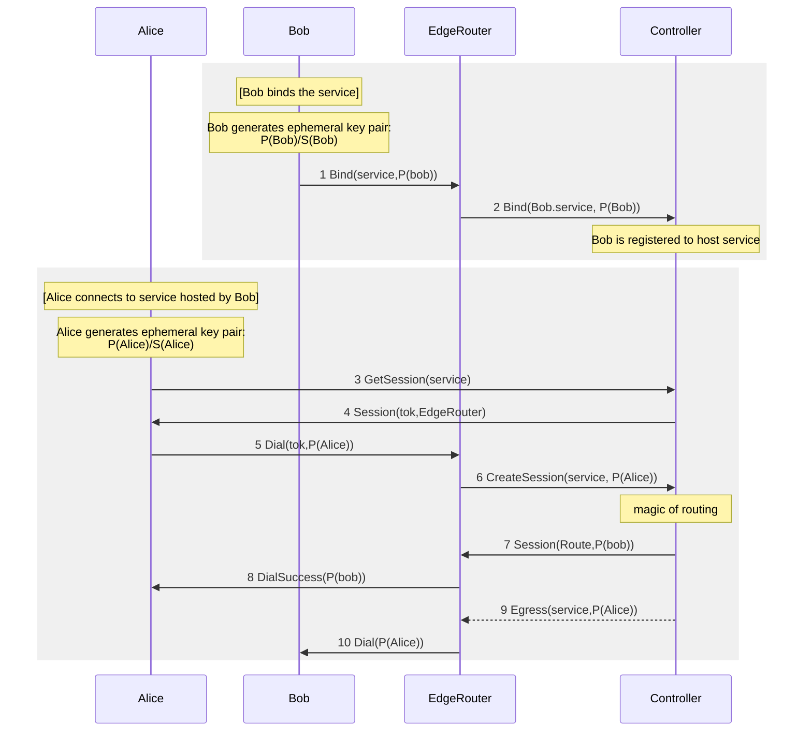
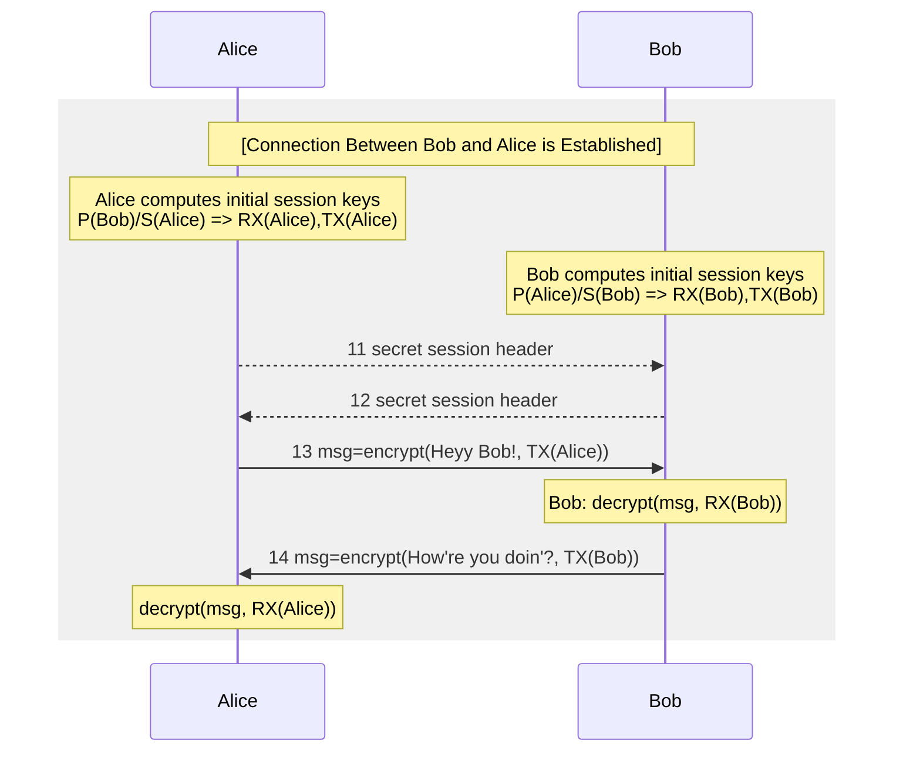

# End-to-end encryption

End-to-end encryption (E2Ee) ensures that data is encrypted at the source and only decrypted by the intended recipient.
This ensures that data remains secure even if the underlying transport or physical infrastructure is compromised along
the communication path.

## The role of communications security

Communications Security (COMSEC) is the discipline of preventing unauthorized interception of communications. In a
traditional network, security is often fragmented across different layers. OpenZiti focuses primarily on cryptographic
security, which serves as a powerful mitigant for weaknesses in other areas, such as physical or transmission security.

For example, if a transmission link is compromised, the snooped packets remain unreadable and unalterable because the
data was encrypted at the client and can only be decrypted at the intended destination.

### Link encryption vs. end-to-end encryption

It's important to distinguish between *link encryption* and *end-to-end encryption*:

- **Link encryption**: Encryption occurs between two network routing points, such as mutual TLS (mTLS) between a client
  and a router in OpenZiti. While this protects data in transit between hops, if a router is compromised by an attacker,
  it becomes possible to capture or alter messages as they're decrypted and re-encrypted within the router's memory.
- **End-to-end encryption**: Data is encrypted within the OpenZiti SDK at the source and remains encrypted throughout
  the entire OpenZiti Fabric. It's only decrypted by the destination SDK, meaning even a compromised OpenZiti router
  can't "see" the raw data.

## Technical requirements and implementation

OpenZiti's encryption implementation is designed to be lightweight, avoiding additional network round trips while
maintaining industry-standard security.

### The libsodium library

Rather than implementing custom cryptography, OpenZiti uses [libsodium](https://doc.libsodium.org/), a widely audited,
open-source library used by major platforms like Discord and WireGuard. This provides cross-platform support across all
OpenZiti SDKs.

### Encryption algorithms

OpenZiti uses the XChaCha20-Poly1305 cipher, an AEAD (authenticated encryption with associated data).

- **Performance**: ChaCha20 is significantly faster than AES-256 on devices without hardware-accelerated AES, like
  mobile phones and IoT edge devices.
- **Strength**: It provides 256-bit security, which is equivalent to the strength of AES-256.

:::note
The "X" in XChaCha20-Poly1305 denotes an *eXtended-nonce* (192-bit vs. the standard 96-bit). This allows
OpenZiti to safely use randomly generated nonces for every message without the risk of collision, making it much more
resilient in distributed, stateless environments where central counter management is impractical.
:::

## Key exchange

OpenZiti leverages established trust via an ephemeral key exchange to bootstrap a secure session while minimizing
latency.

1. **Server-side binding**: When an SDK server binds to a service, it generates an ephemeral key pair and provides its
   public key to the controller.
2. **Client-side dialing**: When a client dials that service, it generates its own ephemeral key pair and sends its
   public key to the controller.
3. **Controller routing**: The controller routes the request, swapping the public keys between the client and server.
4. **Key derivation**: Both parties derive symmetric session keys from their own private keys and the received public
   key.

### Message exchange and forward secrecy

For every message sent, OpenZiti performs the following:

- **Encryption and authentication**: Data is encrypted and a [message authentication code
  (MAC)](https://grokipedia.com/page/Message_authentication_code) is appended to ensure integrity.
- **Key rotation**: The transmission (tx) and reception (rx) keys are rotated immediately after every message. This
  provides [perfect forward secrecy](https://grokipedia.com/page/Forward_secrecy), ensuring that if a future key is
  somehow compromised, past sessions remain secure.

## Performance and overhead

Encryption introduces a small amount of overhead to ensure security:

- **Session start**: One additional 24-byte message is sent at the beginning of a session.
- **Per message**: 17 additional bytes are added to each message.
